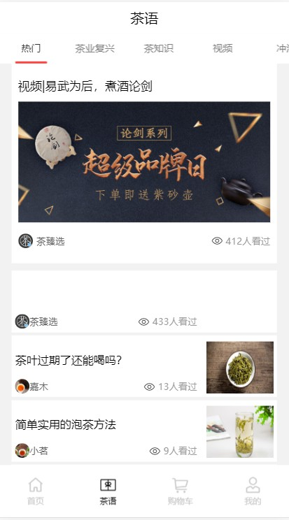
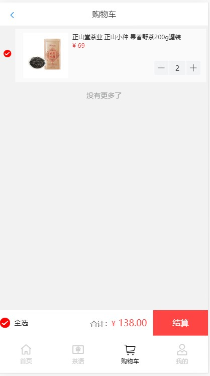
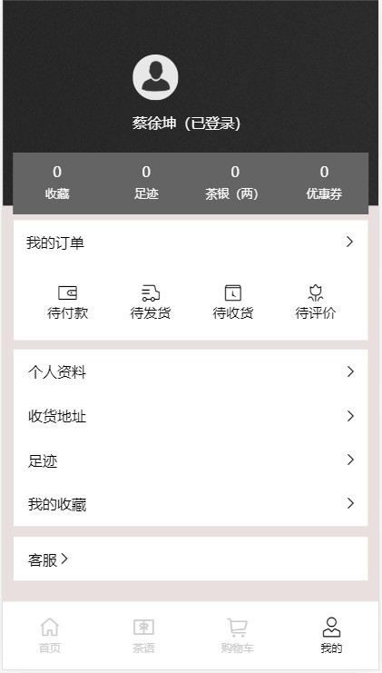

# Vue项目--izhentea（臻茶）+ 后台管理系统

## 项目演示
 *   官网：shop.izhentea.com
 *   项目上线网址：47.96.238.230:1906
 *   后台管理系统上线网址：  47.96.238.230:1907

## git仓管地址
 *   地址: git@github.com:gzh51906/izhentea.git

## 团队与分工
 * 组长：余晓东，成员：黎文德，黄冰群，李俊升
 * 余晓东负责app项目的'茶语'组件部分，商品详情页的开发，并完成了茶语部分详情页的跳转及评论区。搭建后台管理项目的开发环境及nodejs环境，完成了后台管理的添加用户，添加商品详情的功能
 * 黎文德负责app项目开发环境及nodejs环境搭建，完成了'我的'组件的开发，完成了登录注册功能，鉴权，token令牌。后台管理系统的路由跳转及每个列表页的删除功能
 * 黄冰群负责app项目的'首页'组件部分,列表页，详情页数据渲染。主要功能：首页轮播图，首页布局，首页列表数据渲染，跳转详情页，详情页数据渲染，跳转列表页，后台数据渲染到列表页，列表页标签页功能，列表页布局
 * 李俊升负责app项目的'购物车'组件部分,购购物车的样式编写，后台数据渲染到前端，主要功能有：加入购物车功能，购物车商品数量加减功能，商品选中状态改变总价功能，结算页面里的地址创建选择修改功能

 ## 项目页截图
-------
 * 首页
   + 

* 茶语
   +  

* 购物车
   +  

* 我的
   +  


## 项目目录说明
```js
`-- myproject
    |-- README.md     //文档说明
    |-- babel.config.js
    |-- nodejs    //后端接口
    |   |-- package-lock.json
    |   |-- package.json
    |   `-- src
    |       |-- config.json
    |       |-- db
    |       |   |-- mongo.js
    |       |   `-- mysql.js
    |       |-- index.html
    |       |-- router
    |       |   |-- cartlist.js
    |       |   |-- goods.1.js
    |       |   |-- goods.js
    |       |   |-- index.js
    |       |   |-- user.js
    |       |   `-- yulist.js
    |       |-- server.js
    |       `-- utils
    |           |-- index.js
    |           `-- token.js
    |-- package-lock.json
    |-- package.json
    |-- public
    |   |-- favicon.ico
    |   `-- index.html
    `-- src
        |-- App.vue
        |-- assets   //静态资源
        |   |-- area.js
        |   |-- indexbg.a937a31.png
        |   |-- logo-tea.png
        |   |-- logo.png
        |   |-- selfbg.7f3d9ab.png
        |   |-- userbg.8b94fc1.png
        |   `-- \317\302\324\330.png
        |-- components    //细节组件
        |   |-- HelloWorld.vue
        |   |-- argument.vue
        |   |-- chagrid.vue
        |   |-- chayulist.vue
        |   |-- chayutop.vue
        |   |-- goodsbuy.vue
        |   |-- goodtalk.vue
        |   |-- headline.vue
        |   |-- hot.vue
        |   |-- listserve.vue
        |   |-- production.vue
        |   |-- tags.vue
        |   |-- wrapper.vue
        |   |-- yugoods.vue
        |   |-- yupinglun.vue
        |   `-- yutalk.vue
        |-- img      //图片
        |   |-- activity.jpg
        |   |-- banner.png
        |   |-- center.png
        |   |-- centerfoot.png
        |   |-- cyfx.jpg
        |   |-- dat.jpg
        |   |-- floor price.jpg
        |   |-- good tea.jpg
        |   |-- goods.jpg
        |   |-- left-greater.png
        |   |-- li.jpg
        |   |-- list.jpg
        |   |-- long.jpg
        |   |-- lun.jpg
        |   |-- lun2.jpg
        |   |-- related.png
        |   |-- titel.png
        |   |-- titlef.png
        |   |-- touxiang.jpg
        |   `-- xiangq.png
        |-- main.js
        |-- pages       //页面组件
        |   |-- Chayu.vue
        |   |-- Home.vue
        |   |-- Login
        |   |   `-- loginIcode.vue
        |   |-- Login.vue
        |   |-- Mine.vue
        |   |-- Shopcart.vue
        |   |-- address.vue
        |   |-- addresslist.vue
        |   |-- bottom.vue
        |   |-- chaping.vue
        |   |-- goodsdetail.vue
        |   |-- list.vue
        |   |-- livedetail.vue
        |   |-- pay.vue
        |   `-- special.vue
        |-- rem.js
        |-- router   //路由
        |   `-- index.js
        |-- store   //vuex模块化
        |   |-- common.js
        |   |-- index.js
        |   `-- shopcart.js
        `-- utils
```
